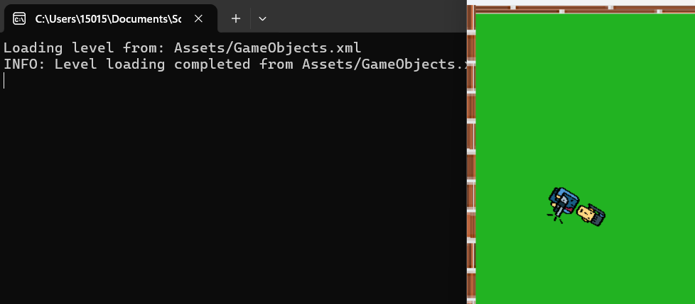

# Game Programming Project Read Me

### Project 2
- **Components Are Used To Give Objects Various Forms Of Functionality**
- **Press The WASD Keys To Move Hero**
- 
- 
- **Press The Space Bar To Have The Enemies Slide**
- 
- 
- **The Hero Now Turns To Face Mouse Position**
- 
- 
- **All Objects Are Now Loaded From An XML At The Start**
- 
- 

### Project 2 Extra Credit 
- To Be Filled In

### Project 3
- **All Images Are Now Loaded Dynamically**
- 
- 
- Note: For Some reason, it kept saying the image was loaded, no matter what i did, so I simply chose to ignore it, since the code did what was necessary, and the logs were only used for testing
- **A View Class Is Now Added That Can Change The Camera View**
- 
- 
- 
- 
- **There Is Now An Equation Used To Get Deltatime And Limit The Frame Rate For A Consistent FPS**
- 
- 

### Project 3 Extra Credis
- To Be Filled In

### Project 4
- **The Engine Has Now Been Integrated To Produce A Box2d World, And All Game Objects Are Integrated With Box2d Bodies**
- 